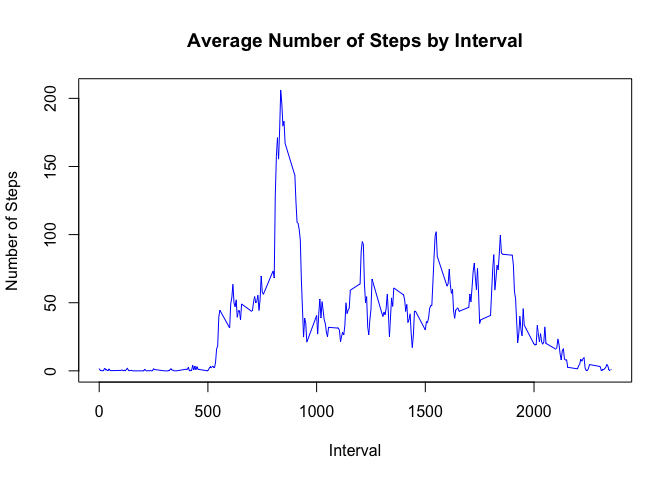

# Reproducible Research: Peer Assessment 1

Set working directory for assignment 


```r
setwd("~/Desktop/RepData_PeerAssessment1")
```

## Loading and preprocessing the data  
  
#### 1. Load data  
The dataset for this assignment makes use of data from a personal activity 
monitoring device. Unzip the file and load the dataset. 


```r
if (!exists("activity.csv")) {
    unzip("activity.zip")
}
data <- read.csv("activity.csv")

head(data)
```

```
##   steps       date interval
## 1    NA 2012-10-01        0
## 2    NA 2012-10-01        5
## 3    NA 2012-10-01       10
## 4    NA 2012-10-01       15
## 5    NA 2012-10-01       20
## 6    NA 2012-10-01       25
```

#### 2. Transforming data classes  
To ensure efficiency, ensure that all columns are classed correctly.


```r
data$steps <- as.numeric(data$steps)
data$date <- as.Date(data$date, "%Y-%m-%d")
data$interval <- as.numeric(data$interval)

str(data)
```

```
## 'data.frame':	17568 obs. of  3 variables:
##  $ steps   : num  NA NA NA NA NA NA NA NA NA NA ...
##  $ date    : Date, format: "2012-10-01" "2012-10-01" ...
##  $ interval: num  0 5 10 15 20 25 30 35 40 45 ...
```
  
  
## What is mean total number of steps taken per day?  

**For this part of the assignment, you can ignore the missing values in the dataset.**  
The above is perceived as not removing the NAs but simply leaving them there and assuming that they are 0

#### 1. Make a histogram of the total number of steps taken each day.  
  
Get the total number of steps each day using aggregate(). Create a new 
dataset "DailySteps" then use this information to create a histogram using base package.


```r
DailySteps <- aggregate(steps ~ date, data, sum)
hist(DailySteps$steps, col = "lightblue", breaks = 15, 
     xlab = "Total Steps", 
     xlim = c(0, 25000), ylim = c(0, 20),
     main = "Total Steps Taken Each Day")
```

\

  
#### 2. Calculate and report the mean and median of the total number of steps taken per day. 

Get the Mean and Median steps from the "DailySteps" data created above.


```r
mean(DailySteps$steps, na.rm = TRUE)
```

```
## [1] 10766.19
```

```r
median(DailySteps$steps, na.rm = TRUE)
```

```
## [1] 10765
```

## What is the average daily activity pattern?

To get the average daily activity patterns,create a new dataset called
"AverageDailyActivity" using aggregate()


```r
AverageDailyActivity <- aggregate(steps ~ interval, data, mean)
```

#### 1. Make a time series plot 

Create a plot of the 5 minute interval and the average number of steps taken using plot() from base package.


```r
plot(AverageDailyActivity$interval,AverageDailyActivity$steps, type="l", 
     col = "blue",  
     xlab="Interval", ylab="Number of Steps",
     main="Average Number of Steps by Interval")
```

\
  
  
#### 2. Which 5-minute interval, on average across all the days in the dataset, contains the maximum number of steps?
Must ensure that interval is classed as a factor variable.


```r
AverageDailyActivity$interval <- as.factor(AverageDailyActivity$interval)

max(AverageDailyActivity$steps)
```

```
## [1] 206.1698
```

```r
AverageDailyActivity$interval[which.max(AverageDailyActivity$steps)]
```

```
## [1] 835
## 288 Levels: 0 5 10 15 20 25 30 35 40 45 50 55 100 105 110 115 120 ... 2355
```

The 5-minute interval with the maximum number of steps is interval 835 with 206.17 steps

## Imputing missing values

#### 1. Calculate and report the total number of missing values in the dataset (i.e. the total number of rows with 𝙽𝙰s)

Total NAs are calculated in the r chunk but the answer is below the chunk.


```r
TotalNAs <- sum(is.na(data$steps))
```


**Total NAs:** 2304


#### 2. Devise a strategy for filling in all of the missing values in the dataset.  

The simpliest strategy was the strategy advised in the asssignment, if there is an NA in the data, it should be replaced by the mean steps.  

#### 3. Create a new dataset that is equal to the original dataset but with the missing data filled in.

Using transform() to transform NAs to the mean steps.
=======
#### 2. Devise a strategy for filling in all of the missing values in the dataset.   
The simpliest strategy was the strategy advised in the asssignment, if there is an NA in the data, it should be replaced by the mean steps.   

#### 3. Create a new dataset that is equal to the original dataset but with the missing data filled in.


```r
ImputeData <- transform(data, steps = ifelse(is.na(data$steps), AverageDailyActivity$steps[match(data$interval, AverageDailyActivity$interval)], data$steps))
```

#### 4. Make a histogram of the total number of steps taken each day.  
Create a new dataset "NewDailySteps" using imputed data then use this information to create a histogram using the base package.


```r
NewDailySteps <- aggregate(steps ~ date, ImputeData, sum)
hist(NewDailySteps$steps, col = "plum3", breaks = 15, 
     xlab = "Total Steps", 
     xlim = c(0, 25000), ylim = c(0, 25),
     main = "Total Steps Taken Each Day")
```

\


#### Calculate and report the mean and median total number of steps taken per day. Do these values differ from the estimates from the first part of the assignment?   

Get the mean and median steps from the "NewDailySteps" data created above.


```r
mean(NewDailySteps$steps, na.rm = TRUE)
```

```
## [1] 10766.19
```

```r
median(NewDailySteps$steps, na.rm = TRUE)
```

```
## [1] 10766.19
```

The mean and median are the same for the imputed data. This contrasts to the previous results, the median was 10765. The change is due to replacing the NAs with the mean value of the data.  

## Are there differences in activity patterns between weekdays and weekends?

#### 1. Create a new factor variable in the dataset with two levels – “weekday” and “weekend” indicating whether a given date is a weekday or weekend day.

Create a new column called "dow", a factor variable with two levels, Weekday for Monday to Friday and Weekend for Saturday to Sunday.


```r
weekdays <- c("Monday", "Tuesday", "Wednesday", "Thursday", 
              "Friday")

ImputeData$dow = as.factor(ifelse(is.element(weekdays(as.Date(ImputeData$date)),weekdays), "Weekday", "Weekend"))
```

#### 2. Make a panel plot containing a time series plot.

create a new dataset "dowSteps" using imputed data then use this information to create a plot using lattice plotting package.


```r
dowSteps <- aggregate(steps ~ interval + dow, ImputeData, mean)

library(lattice)

xyplot(dowSteps$steps ~ dowSteps$interval|dowSteps$dow, main="Average Daily Steps by Interval",xlab="Interval", ylab="Steps",layout=c(1,2), type="l")
```

\

